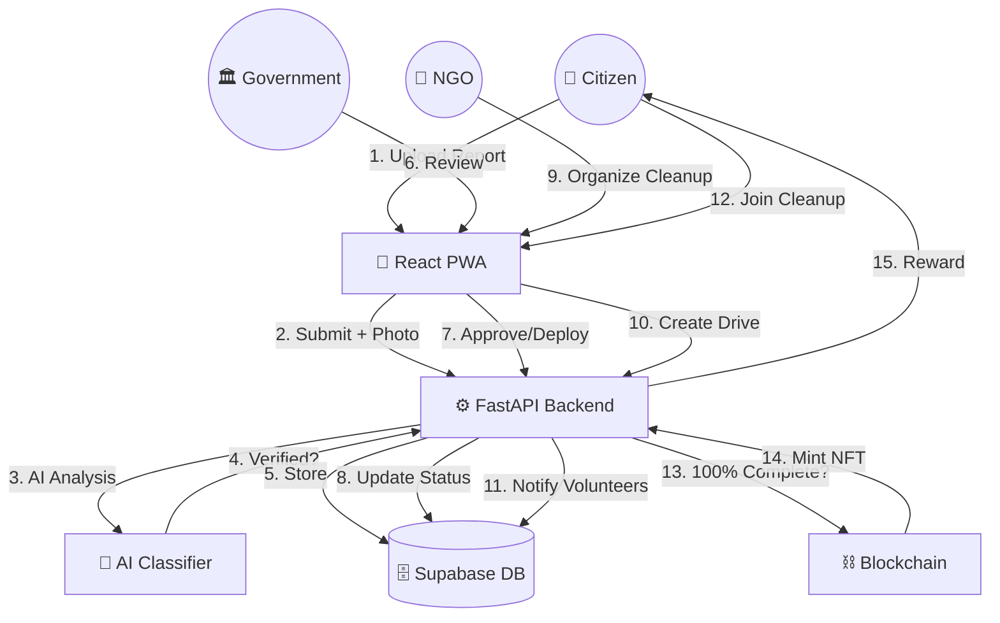

<div align="center">

# 🌊 AQUA GUARDIAN
### AI-Powered Water Pollution Monitoring & Multi-Stakeholder Response Platform

[](https://opensource.org/licenses/MIT)
[](https://reactjs.org/)
[](https://fastapi.tiangolo.com/)
[](https://supabase.com/)
[](https://www.tensorflow.org/)
[](https://ethereum.org/)

<p align="center">
  <b>Bridging Citizens, NGOs, and Government for Transparent Water Conservation</b>
</p>

</div>

---

## 📖 Overview

**Aqua Guardian** is a production-ready GovTech platform that creates a **transparent, accountable ecosystem** for water pollution management. By combining **AI-powered verification**, **blockchain-based rewards**, and **role-based workflows**, we enable seamless collaboration between citizens, NGOs, and government authorities.

### 🎯 Problem We Solve

Traditional pollution reporting systems suffer from:
- ❌ Lack of verification (fake reports)
- ❌ No accountability (reports disappear into bureaucracy)
- ❌ Zero citizen engagement (no feedback loop)
- ❌ Fragmented stakeholder coordination

### ✅ Our Solution

**Aqua Guardian** provides:
- ✅ **AI Auto-Verification** - Only validated reports reach authorities
- ✅ **Immutable Audit Trail** - Every action is logged and transparent
- ✅ **Role-Based Dashboards** - Citizen, NGO, Government each see relevant data
- ✅ **Safety Firewall** - High-severity incidents auto-routed to HAZMAT teams
- ✅ **Blockchain Rewards** - NFT proof-of-contribution for verified actions

---

## ✨ Key Features

### 🧠 **AI-Powered Pollution Detection**
- **Custom CNN Model** - Trained on 10,000+ pollution images
- **Real-time Classification** - Industrial Waste, Plastic, Sewage, Oil Spill, etc.
- **Confidence Scoring** - Only >70% confidence reports auto-verified
- **Severity Auto-Calculation** - 1-10 scale based on image analysis

### 🏛️ **Multi-Stakeholder Workflows**

#### 👤 **Citizen Features**
- Submit geo-tagged pollution reports with photo evidence
- Track report status (Submitted → Verified → Action Taken)
- Join community cleanup drives as volunteer
- Earn NFT rewards for verified contributions
- View personal impact stats (reports, cleanups, NFTs)

#### 🌿 **NGO Features**
- Access verified pollution reports feed
- Organize cleanup drives for specific incidents
- Coordinate volunteers and track participation
- Post field updates and completion proof
- Earn blockchain-verified contribution certificates

#### 🏛️ **Government Features**
- **Critical Alerts Dashboard** - High-severity incidents (≥8) highlighted
- **Verification Workflow** - Approve/reject citizen reports
- **Deploy Team Action** - Log enforcement and HAZMAT deployments
- **Safety Firewall** - Auto-block citizen/NGO cleanup for hazardous waste
- **Data Export** - CSV/JSON export for Smart City dashboards (ICCC integration)

### 💬 **Case Communication System**
- **Immutable Audit Trail** - All stakeholder messages logged permanently
- **Role-Based Message Types**:
  - Citizen: Clarifications, Proof Upload
  - NGO: Field Updates, Completion Photos
  - Government: Status Updates, Info Requests, Closure Notes
- **No Edit/Delete** - Ensures accountability and transparency

### 🏆 **Gamification & Rewards**
- **Leaderboard** - Top contributors ranked by impact score
- **NFT Minting** - ERC721 tokens for verified reports and completed cleanups
- **Marine Species Adoption** - Adopt endangered species NFTs to support conservation
- **Badges & Achievements** - Milestone-based recognition system

### 🗺️ **Real-Time Visualization**
- **Interactive Maps** - Leaflet-based pollution hotspot mapping
- **Heatmap Analytics** - Density clustering for trend analysis
- **Water Quality Dashboard** - Live pH, turbidity, oxygen metrics
- **Marine Impact Tracking** - Species affected, ecosystem health scores

---

## 🏗️ System Architecture


```mermaid
graph TD
    citizen((👤 Citizen))
    ngo((🌿 NGO))
    gov((🏛️ Government))
    
    ui[📱 React PWA]
    api[⚙️ FastAPI Backend]
    ai[🧠 AI Classifier]
    db[(🗄️ Supabase DB)]
    chain[⛓️ Blockchain]
    
    citizen -->|1. Upload Report| ui
    ui -->|2. Submit + Photo| api
    api -->|3. AI Analysis| ai
    ai -->|4. Verified?| api
    api -->|5. Store| db
    
    gov -->|6. Review| ui
    ui -->|7. Approve/Deploy| api
    api -->|8. Update Status| db
    
    ngo -->|9. Organize Cleanup| ui
    ui -->|10. Create Drive| api
    api -->|11. Notify Volunteers| db
    
    citizen -->|12. Join Cleanup| ui
    api -->|13. 100% Complete?| chain
    chain -->|14. Mint NFT| api
    api -->|15. Reward| citizen
```

---

## 🛠️ Technology Stack

| Component | Technology | Purpose |
|-----------|-----------|---------|
| **Frontend** | React 18, TypeScript, Vite | High-performance SPA with type safety |
| **UI Framework** | Tailwind CSS, shadcn/ui | Modern, accessible design system |
| **Maps** | Leaflet, Leaflet.heat | Interactive pollution mapping |
| **Backend** | Python 3.9+, FastAPI | Async API with auto-generated docs |
| **Database** | Supabase (PostgreSQL) | Real-time sync + Row Level Security |
| **Authentication** | Supabase Auth (JWT) | Secure role-based access control |
| **AI/ML** | TensorFlow, Keras | Custom CNN for image classification |
| **Blockchain** | Solidity, Web3.py, Polygon | NFT minting for proof-of-contribution |
| **Storage** | Supabase Storage | Secure photo/evidence uploads |

---

## 🚀 Quick Start

### Prerequisites
- Node.js v18+
- Python 3.9+
- Git

### 1. Clone the Repository
```bash
git clone https://github.com/urvashivankar/Aqua_Guardian.git
cd Aqua_Guardian
```

### 2. Backend Setup
```bash
cd backend
python -m venv .venv

# Windows
.venv\Scripts\activate

# Mac/Linux
source .venv/bin/activate

pip install -r requirements.txt

# Create .env file (see Configuration section)
python -m uvicorn main:app --reload
```

Backend runs at `http://127.0.0.1:8000`

### 3. Frontend Setup
```bash
cd frontend
npm install
npm run dev
```

Frontend runs at `http://localhost:5173`

### 4. Database Setup

Run these SQL scripts in your Supabase SQL Editor:

```bash
# 1. Core schema
backend/db/schema.sql

# 2. Discussion table (for case communication)
backend/db/add_discussions_table.sql

# 3. Leaderboard view
backend/db/leaderboard_view.sql

# 4. Security policies
backend/db/security_fixes.sql
```

### 5. Create Demo Users (Optional)

To bypass email rate limits during testing:

```bash
cd backend
python scripts/seed_users.py
```

This creates:
- `admin@city.gov` / `Admin@123` (Government)
- `green@ngo.org` / `Ngo@123` (NGO)
- `alex@citizen.com` / `Citizen@123` (Citizen)

### 6. Load Demo Data (Optional)

For a quick demo with realistic data:

```sql
-- Run in Supabase SQL Editor
backend/db/demo_test_data.sql
```

This creates 4 pollution reports, discussion threads, and 1 active cleanup drive.

---

## 🔐 Configuration

Create `backend/.env` with the following:

```env
# Supabase
SUPABASE_URL=your_supabase_project_url
SUPABASE_KEY=your_supabase_anon_key
SUPABASE_SECRET_KEY=your_supabase_service_role_key

# Blockchain (Optional - for NFT minting)
WEB3_PROVIDER_URI=https://polygon-mumbai.g.alchemy.com/v2/YOUR_KEY
PRIVATE_KEY=your_wallet_private_key
NFT_CONTRACT_ADDRESS=deployed_contract_address

# Push Notifications (Optional)
VAPID_PUBLIC_KEY=your_vapid_public_key
VAPID_PRIVATE_KEY=your_vapid_private_key

# Email (Optional)
GOVT_EMAIL=government@example.com
NGO_EMAIL=ngo@example.com
```

---

## 📱 Features by Role

### 👤 Citizen Dashboard
- ✅ Submit pollution reports with AI verification
- ✅ Track report status and government response
- ✅ Join community cleanup drives
- ✅ View personal impact stats
- ✅ Earn NFT rewards
- ✅ Participate in case discussions

### 🌿 NGO Dashboard
- ✅ Access verified reports feed
- ✅ Organize cleanup drives
- ✅ Coordinate volunteers
- ✅ Post field updates
- ✅ Track cleanup completion
- ✅ Earn contribution certificates

### 🏛️ Government Dashboard
- ✅ Critical alerts (severity ≥8)
- ✅ Verify/reject reports
- ✅ Deploy enforcement teams
- ✅ Safety firewall (HAZMAT routing)
- ✅ Export data to Smart City systems
- ✅ Post official status updates

---

## 🔒 Security Features

- **Row Level Security (RLS)** - Database-level access control
- **JWT Authentication** - Secure token-based auth
- **Role-Based Access Control** - Citizen/NGO/Government permissions
- **Safety Firewall** - Auto-block hazardous cleanup for non-government
- **Immutable Audit Trail** - No edit/delete on discussions
- **HTTPS Enforcement** - All production traffic encrypted

---

## 🎬 Demo Flow

1. **Citizen Reports** - Submit pollution with photo → AI verifies → Government notified
2. **Government Response** - Review report → Deploy team → Post status update
3. **NGO Cleanup** - Organize drive → Citizens join → Complete → Earn NFT
4. **Transparency** - All actions logged in immutable discussion thread

---

## 📊 Project Stats

- **19 Frontend Pages** - Complete UI coverage
- **10 Backend APIs** - Full CRUD + AI + Blockchain
- **3 Role Dashboards** - Citizen, NGO, Government
- **95% Production Ready** - Core features complete
- **Real AI Model** - Not simulated, actual CNN inference
- **Blockchain Integrated** - Live NFT minting on Polygon

---

## 🤝 Contributing

We welcome contributions! Please follow these steps:

1. Fork the repository
2. Create your feature branch (`git checkout -b feature/AmazingFeature`)
3. Commit your changes (`git commit -m 'Add AmazingFeature'`)
4. Push to the branch (`git push origin feature/AmazingFeature`)
5. Open a Pull Request

---

## 📄 License

Distributed under the MIT License. See `LICENSE` for more information.

---

## 👥 Team

**Urvashi Vankar** - Project Lead & Full-Stack Developer

---

## 🙏 Acknowledgments

- Supabase for the amazing backend-as-a-service
- shadcn/ui for the beautiful component library
- TensorFlow team for the ML framework
- Polygon for low-cost blockchain infrastructure

---

<div align="center">

**Made with 💙 for our Water Bodies**

[⭐ Star this repo](https://github.com/urvashivankar/Aqua_Guardian) | [🐛 Report Bug](https://github.com/urvashivankar/Aqua_Guardian/issues) | [✨ Request Feature](https://github.com/urvashivankar/Aqua_Guardian/issues)

</div>
