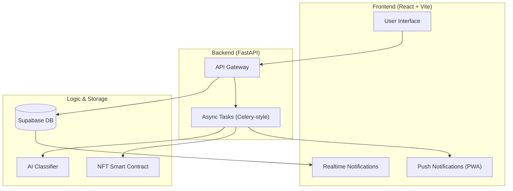

# 🌊 AQUA Guardian

**AI-Powered Water Pollution Monitoring & Reporting System**

AQUA Guardian is a comprehensive platform designed to empower citizens and authorities to monitor, report, and combat water pollution. It leverages AI for automated pollution classification, blockchain for immutable record-keeping, and a modern dashboard for real-time analytics.

---

## ✨ Updated Features

### 🚀 Performance & Intelligence
- **⚡ Instant AI Reporting**: Background inference pipeline allows for immediate user response. AI analyzes reports in the background (70%+ confidence threshold for verification).
- **🛰️ Geographic Heatmaps**: Visualize pollution density and hotspots at a glance with interactive clustering.
- **🛡️ Security Hardening**: Fully implemented Row Level Security (RLS) and PostgreSQL function protection.

### 🔔 Smart Notifications
- **📱 PWA & Mobile Push**: "Install to Home Screen" support with system-level push notifications for Android & iOS.
- **⚡ Real-time Updates**: Live dashboard alerts powered by Supabase Realtime for reports and cleanup actions.
- **🏛️ Authority Integration**: High-priority reports automatically notify relevant NGOs and Government bodies via centralized email alerts.

### 🏆 Gamification & Trust
- **🥇 Community Leaderboard**: Real-time ranking system to celebrate top environmental guardians.
- **⛓️ NFT Proof of Contribution**: Automatic minting of ERC721 NFTs for verified pollution reports and completed cleanup actions.
- **📜 Immutable Logs**: Every verified report is hashed and logged on-chain for total transparency.

---

## 🌐 System Architecture


```mermaid
graph TD
    subgraph "Frontend (React + Vite)"
        UI["User Interface"]
        RT["Realtime Notifications"]
        PN["Push Notifications (PWA)"]
    end

    subgraph "Backend (FastAPI)"
        API["API Gateway"]
        BT["Async Tasks (Celery-style)"]
    end

    subgraph "Logic & Storage"
        ML["AI Classifier"]
        DB[("Supabase DB")]
        SC["NFT Smart Contract"]
    end

    UI --> API
    API --> DB
    API --> BT
    BT --> ML
    BT --> SC
    BT --> PN
    DB --> RT
```

---

## 🏁 Quick Start

### 1. Backend Setup
```bash
cd backend
python -m venv .venv
# Windows: .venv\Scripts\activate
pip install -r requirements.txt
python -m uvicorn main:app --reload
```

### 2. Frontend Setup
```bash
cd frontend
npm install
npm run dev
```

### 3. Database & Keys
Run the provided SQL scripts in your Supabase SQL Editor:
- `backend/db/schema.sql` (Base Schema)
- `backend/db/leaderboard_view.sql` (Gamification)
- `backend/db/push_subscriptions.sql` (Mobile Push)
- `backend/db/enable_realtime.sql` (Live Update)

---

## 🛠️ Tech Stack

- **Frontend**: React, TypeScript, Leaflet (Heatmaps), Tailwind / Shadcn UI.
- **Backend**: FastAPI, Web3.py, PyWebPush.
- **Database**: Supabase / PostgreSQL with RLS.
- **Blockchain**: Solidity (Hardhat), Ethereum/Polygon.

---

## 📄 License
Distributed under the MIT License.
