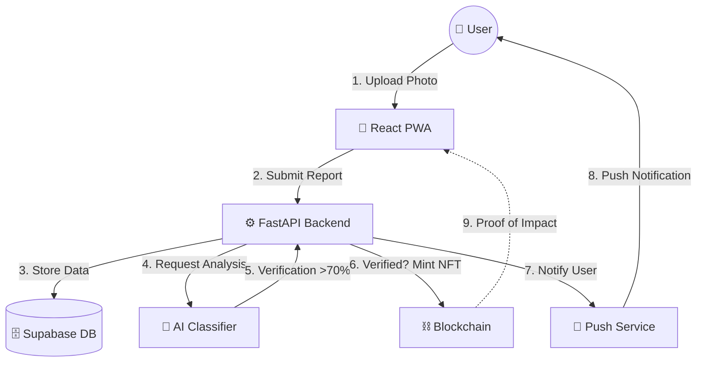

<div align="center">

# 🌊 AQUA GUARDIAN
### AI-Powered Ecosystem for Water Pollution Monitoring & Reporting

[](https://opensource.org/licenses/MIT)
[](https://reactjs.org/)
[](https://fastapi.tiangolo.com/)
[](https://supabase.com/)
[](https://www.tensorflow.org/)
[](https://ethereum.org/)

<p align="center">
  <b>Empowering citizens to protect our water bodies through Artifical Intelligence and Blockchain Technology.</b>
</p>

</div>

---

## 📖 Overview

**Aqua Guardian** is a next-generation environmental platform that bridges the gap between verified citizen reporting and actionable authority response. By combining **Deep Learning** for automated verification with **Blockchain** for immutable rewards, we create a transparent and gamified ecosystem for water conservation.

## ✨ Key Features

### 🧠 Intelligent Reporting
*   **AI Auto-Verification**: Uses a custom CNN model to analyze uploaded images in real-time. Only pollution reports with >70% confidence are verified.
*   **Instant Feedback**: Users receive immediate validation of their contribution.

### 🗺️ Real-Time Visualization
*   **Heatmap Analytics**: Interactive density maps visualize pollution hotspots for NGOs and government bodies.
*   **Live Dashboard**: Real-time stats on water quality, active reports, and cleanup progress.

### 📱 Mobile First (PWA)
*   **Progressive Web App**: Installable on Android and iOS devices.
*   **Smart Push Notifications**: System-level alerts notify users instantly when their report is verified or a cleanup is organized nearby.

### 🏆 Gamification & Rewards
*   **Leaderboards**: Compete with other "Guardians" in your community.
*   **NFT Rewards**: Earn unique **ERC721 Proof-of-Contribution NFTs** for every verified report and cleanup action.
*   **Immutable Legacy**: Your environmental impact is permanently recorded on the blockchain.

---

## 🏗️ System Architecture

Our platform relies on a seamless flow of data between the user, the AI inference engine, and the public ledger.


```mermaid
graph TD
    user((👤 User))
    ui[📱 React PWA]
    api[⚙️ FastAPI Backend]
    ai[🧠 AI Classifier]
    db[(🗄️ Supabase DB)]
    chain[⛓️ Blockchain]
    alert[🔔 Push Service]

    user -->|1. Upload Photo| ui
    ui -->|2. Submit Report| api
    api -->|3. Store Data| db
    api -->|4. Request Analysis| ai
    ai -->|"5. Verification >70%"| api
    api -->|6. Verified? Mint NFT| chain
    api -->|7. Notify User| alert
    alert -->|8. Push Notification| user
    chain -.->|9. Proof of Impact| ui
```

---

## 🛠️ Technology Stack

| Component | Technology | Description |
| :--- | :--- | :--- |
| **Frontend** | React, Vite, TypeScript | High-performance PWA with extensive type safety. |
| **UI Framework** | Tailwind CSS, Shadcn/UI | Modern, responsive, and accessible design system. |
| **Maps** | Leaflet, Leaflet.heat | Lightweight interactive maps and density clustering. |
| **Backend** | Python, FastAPI | Asynchronous API handling AI tasks and Web3 logic. |
| **Database** | Supabase (PostgreSQL) | Real-time data syncing and Row Level Security (RLS). |
| **AI/ML** | TensorFlow, Keras | Custom Convolutional Neural Network (CNN) for image analysis. |
| **Blockchain** | Solidity, Web3.py | Smart Contracts on Ethereum/Polygon for NFT minting. |
| **Notifications** | PyWebPush, Service Workers | VAPID-encrypted push notifications for mobile devices. |

---

## 🚀 Quick Start

### Prerequisites
*   Node.js v18+
*   Python 3.9+
*   Git

### 1. Clone the Repository
```bash
git clone https://github.com/urvashivankar/Aqua_Guardian.git
cd Aqua_Guardian
```

### 2. Backend Setup
```bash
cd backend
python -m venv .venv
# Windows: .venv\Scripts\activate
# Mac/Linux: source .venv/bin/activate

pip install -r requirements.txt
# Create a .env file based on .env.example
python -m uvicorn main:app --reload
```

### 3. Frontend Setup
```bash
cd frontend
npm install
npm run dev
```

Visit `http://localhost:5173` to see the app in action!

---

## 🔐 Configuration

To fully enable all features (AI, Blockchain, Push Notifications), you will need to configure the following in your `backend/.env`:

*   **Supabase**: `SUPABASE_URL`, `SUPABASE_KEY`
*   **Blockchain**: `WEB3_PROVIDER_URI`, `PRIVATE_KEY`, `NFT_CONTRACT_ADDRESS`
*   **Push Notifications**: `VAPID_PUBLIC_KEY`, `VAPID_PRIVATE_KEY`
*   **Email**: `GOVT_EMAIL`, `NGO_EMAIL`

---

## 🤝 Contributing

We welcome contributions! Please fork the repository and submit a Pull Request.

1.  Fork the Project
2.  Create your Feature Branch (`git checkout -b feature/AmazingFeature`)
3.  Commit your Changes (`git commit -m 'Add some AmazingFeature'`)
4.  Push to the Branch (`git push origin feature/AmazingFeature`)
5.  Open a Pull Request

---

## 📄 License

Distributed under the MIT License. See `LICENSE` for more information.
