<div align="center">

# 🌊 AQUA GUARDIAN
### AI-Powered Water Pollution Monitoring & Multi-Stakeholder Response Platform

[](https://opensource.org/licenses/MIT)
[](https://reactjs.org/)
[](https://fastapi.tiangolo.com/)
[](https://supabase.com/)
[](https://groq.com/)
[](https://groq.com/)

<p align="center">
  <b>Reclaiming our Water Bodies through AI-Verified Accountability & Transparent Action</b>
</p>

</div>

---

## 📖 Overview

**Aqua Guardian** is an advanced GovTech ecosystem designed to eliminate the accountability gap in water pollution management. By integrating **Next-Gen Vision AI**, **Role-Based Command Centers**, and an **Independent Audit Loop**, we transform simple citizen complaints into verified restoration results.

### 🛡️ The "Chain of Trust" Workflow
1.  **Citizen Reports**: Uploads pollution photo via GPS-tagged mobile interface.
2.  **AI Audit**: **Llama 4 Vision (Maverick)** analyzes the image in <200ms to verify severity and type.
3.  **Gov Action**: Authorities receive critical alerts and **must upload cleanup proof** to progress.
4.  **NGO Verification**: Independent NGOs audit the proof before a case is marked "Resolved."
5.  **Public Transparency**: Successes are automatically visualized as "Before & After" stories.

---

## ✨ Key Features

### 🧠 **Neural Verification System**
- **LLM-Vision Integration**: Powered by **Llama 3.2 Vision** on **Groq LPU** for sub-second inference.
- **Smart Filtering**: Automatically rejects spam or invalid images (cars, indoors, people).
- **Heuristic Impact Analysis**: AI-driven estimation of Water Quality Index (WQI) improvement and community reach.

### 🏛️ **Role-Specific Command Centers**

#### 👤 **Citizen Dashboard**
- **Real-time Map**: GIS tracking of local pollution hotspots.
- **Impact Tracker**: Personal metrics on reports submitted and verified cleanups.
- **Gamified Rewards**: Contribution points and marine species adoption.

#### 🏛️ **Government Master Dashboard**
- **Critical Alerts**: Severity-based priority filtering for urgent hazardous leaks.
- **SLA Tracking**: "Response Age" monitoring to ensure administrative efficiency.
- **Proof-of-Work**: Forced photo verification module for every assigned cleanup task.

#### 🌿 **NGO Verification Hub**
- **Independent Auditor Access**: Dual-pane view for side-by-side "Before vs After" cleanup auditing.
- **Campaign Launcher**: Organize regional cleanup drives and mobilize community volunteers.
- **Transparency Logs**: Immutable audit trails of every status transition.

### 📸 **Impact Transparency Board**
- **Dynamic Success Stories**: Automatic generation of restoration comparisons for resolved incidents.
- **Manual Story Creation**: Curated "Model Success" stories with detailed descriptions of ecosystem recovery.
- **Collective Stats**: Real-time counter for species recovered, liters of water restored, and total communities impacted.

---

## 🏗️ System Architecture

```mermaid
graph TD
    citizen((👤 Citizen))
    ngo((🌿 NGO))
    gov((🏛️ Government))
    
    ui[📱 React + Tailwind UI]
    api[⚙️ FastAPI Backend]
    ai[🧠 Llama 4 Vision - Groq]
    db[(🗄️ Supabase / PG)]
    
    citizen -->|1. Submit Report| ui
    ui -->|2. Photo + Data| api
    api -->|3. Vision Analysis| ai
    ai -->|4. Confidence Check| api
    api -->|5. Log to DB| db
    
    gov -->|6. Cleanup Proof| ui
    ui -->|7. Upload 'After' Photo| api
    api -->|8. Pending NGO Verification| db
    
    ngo -->|9. Audit Proof| ui
    ui -->|10. Final Resolution| api
    api -->|11. Generate Success Story| db
    
    db -->|12. Real-time Impact| ui
```



---

## 🛠️ Technology Stack

| Component | Technology | Pursuit |
|-----------|-----------|---------|
| **Frontend** | React 18, Vite, TS | Performance & Type Safety |
| **Styling** | Tailwind CSS, Shadcn UI | Oceanic Glassmorphism Design |
| **Logic** | Python 3.10+, FastAPI | High-Concurrency Asynchronous API |
| **AI Engine** | Llama 3.2 Vision (Maverick) | Advanced Multimodal Understanding |
| **AI Inference** | Groq Cloud LPUs | Deterministic Sub-Second Latency |
| **Analytics** | Recharts, Leaflet.js | Interactive Visualization & Mapping |
| **Database** | Supabase (PostgreSQL) | Real-time Sync & RLS Security |

---

## 🚀 Setup & Installation

### 1. Clone & Prep
```bash
git clone https://github.com/urvashivankar/Aqua_Guardian.git
cd Aqua_Guardian
```

### 2. Backend (Engine)
```bash
cd backend
python -m venv .venv
source .venv/bin/activate  # or .venv\Scripts\activate
pip install -r requirements.txt
python -m uvicorn main:app --reload
```
*Requires `GROQ_API_KEY`, `SUPABASE_URL`, and `SUPABASE_KEY` in `.env`*

### 3. Frontend (Interface)
```bash
cd frontend
npm install
npm run dev
```

### 4. Demo Credentials
Use these accounts to explore the different user perspectives:

| Role | Email | Password | Access |
|------|-------|----------|--------|
| **NGO (Admin)** | `green@ngo.org` | `Ngo@123` | Impact Dashboard, Action Center |
| **Citizen** | `alex@citizen.com` | `Citizen@123` | Report Submission, Points |
| **Government** | `ahm.manager@gmail.com` | `Govt@123` | Authority Dashboard (Ahmedabad) |

> **Note:** For full government access during demos, logged-in NGOs can toggle "Authority Mode" via the developer console.

---

## ⚖️ License
Distributed under the MIT License. See `LICENSE` for more information.

---

<div align="center">

**Created by [Urvashi Vankar](https://github.com/urvashivankar) & [Nidhi Bajariya](https://github.com/nidhi-bajariya)**

[⭐ Star the project](https://github.com/urvashivankar/Aqua_Guardian) | [🎥 Watch Demo](#)

</div>
